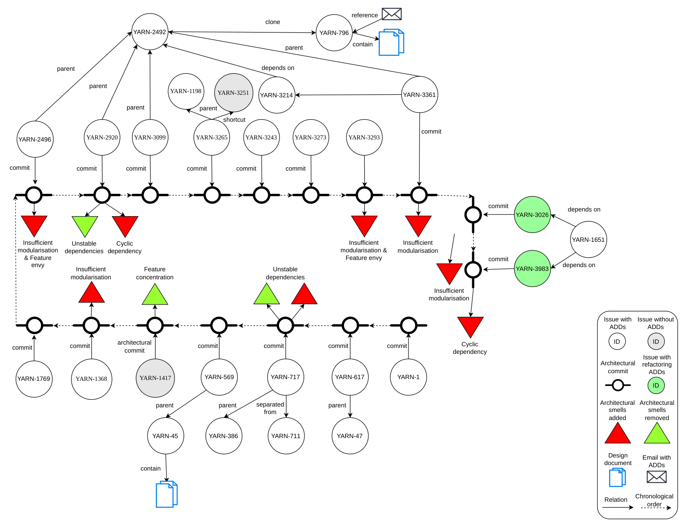

# Architectural and Design Smell Analysis Dataset for Hadoop YARN Issues

This repository contains the architectural and design smell analysis results for a set of Hadoop YARN issues.  
The smells were detected using the tool Designite and analyzed across parent-child commit pairs to identify smell evolution.

The repository is created to investigate:

- the evolution of architectural and design smells,
- their persistence across commits,
- and their relation to software maintenance and refactoring activities in Hadoop YARN.

The following graph illustrates example relationships among analyzed YARN issues and smell evolution patterns.




## Repository Structure

The root directory conatins a directory called `smells` and within it, there are multiple folders corresponding to Hadoop YARN issues:

```text
smells/
├── YARN-1/
├── YARN-47/
├── YARN-386/
├── ...
```

Each `YARN-*` folder represents one issue analyzed in the study.

---

## Structure of Each YARN Issue Folder

Each issue folder contains two main directories:

```text
parent commit/
child commit/
architecture smells comparison
design smells comparison
```

These directories contain the smell analysis results generated by Designite for:

- the parent commit
- the child commit

Each `YARN-*` folder also includes:

- Architectural smell reports
- Design smell reports

Example:

```text
YARN-3983/
├── parent commit/
│   ├── architecture-smells.csv
│   └── design-smells.csv
│   └── ...
│
├── child commit/
│   ├── architecture-smells.csv
│   └── design-smells.csv
│   └── ...
├── ArchitetcureSmells_comparison.xlsx
└── DesignSmalls_comparison.xlsx
```

---

## Smell Evolution Analysis

A Python script was used to compare the smell reports between each parent-child commit pair.

The script identifies:

- Added smells
- Removed smells
- Persistent smells

for both architectural smells and design smells across all analyzed YARN issues.

---

## Tool Used

Smell detection was performed using:

- Designite

Tool website:

https://www.designite-tools.com/

---

## Notes

- Parent-child commit pairs were manually selected based on the analyzed issues.
- Smell evolution results are generated automatically through custom Python scripts.
